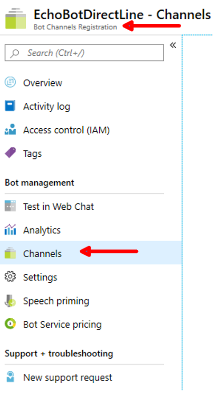
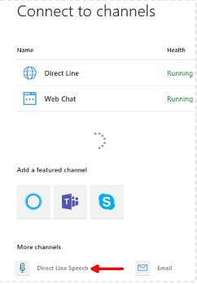
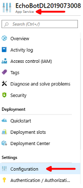
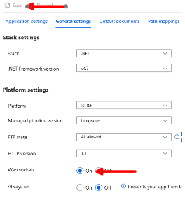
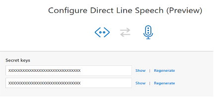

# Connect a bot to Direct Line Speech (Preview)

[!INCLUDE[applies-to-v4](includes/applies-to.md)]

You can configure your bot to allow client applications to communicate with it through the Direct Line Speech channel.

Once you have built your bot, onboarding it with Direct Line Speech will enable low latency, high reliability connection with client applications using the [Speech SDK](https://aka.ms/speech-services-docs). These connections are optimized for voice in, voice out conversational experiences. For more information on Direct Line Speech and how to build client applications, visit the [custom voice-first virtual assistant](https://aka.ms/voice-first-va) page.  

## Sign up for Direct Line Speech Preview

Direct Line Speech is currently in preview and requires a quick sign-up in the [Azure Portal](https://portal.azure.com). See details below. Once approved, you will get access to the channel.

## Add the Direct Line Speech channel

1. In your browser, navigate to the [Azure Portal](https://portal.azure.com). From your resources, select your **Bot Channel Registration** resource. Click on **Channels** in the *Bot management* section of the configuration blade.

    

1. In the channel selection page, find and click `Direct Line Speech` to choose the channel.

    

1. If you have not yet been approved for access, you will see a page for requesting access. Fill in the requested information and click 'Request'. A confirmation page will show up. While your request is pending approval, you will not be able to go beyond this page.   

1. Once approved for access, a configuration page for Direct Line Speech will be shown. Once you've reviewed the terms of use, click `Save` to confirm your channel selection.

    

## Enable the Bot Framework Protocol Streaming Extensions

With the Direct Line Speech channel connected to your bot, you now need to enable Bot Framework Protocol Streaming Extensions support for optimal, low-latency interaction.

1. In the **Bot Channel Registration** resource configuration blade, click on **Settings** under the **Bot Management** category (right below **Channels**). Click the checkbox for **Enable Streaming Endpoint**.

    

1. At the top of the page, click **Save**.

1. From your resources, select your **App Service** resource. In the displayed blade, under the **Settings** category, click **Configuration**.

    

1. Click on `General settings` tab and then select the option to enable `Web socket` support.

    

1. Click `Save` at the top of the configuration page.

1. The Bot Framework Protocol Streaming Extensions are now enabled for your bot. You are now ready to update your bot code and [integrate Streaming Extensions support](https://aka.ms/botframework/addstreamingprotocolsupport) to an existing bot project.

## Manage secret keys

Client applications will need a channel secret to connect to your bot through the Direct Line Speech channel. Once you've saved your channel selection, you can retrieve these secret keys following the next steps.

1. From your resources, select your **Bot Channel Registration** resource. Click on **Channels** in the *Bot management* section of the configuration blade.
1. Click the **Edit** link for the Direct Line Speech.

    

    The following window is displayed.

    
1. Show and copy the keys to use in your application.

## Adding protocol support to your bot

With the Direct Line Speech channel connected and support for the Bot Framework Protocol Streaming Extensions enabled, all that's left is to add code to your bot to support the optimized communication. Follow the instructions on [adding Streaming Extensions support to your bot](https://aka.ms/botframework/addstreamingprotocolsupport) to ensure full compatibility with Direct Line Speech.

## Known Issues

Note that the service is in preview and subject to change, which may affect your bot development and overall performance. Here is a list of known issues: 

1. The service is currently deployed to [Azure region](https://azure.microsoft.com/global-infrastructure/regions/) west US 2. We will roll out to other regions soon, so all customers will get the benefit of low-latency speech interactions with their bots.

1. Minor changes to control fields, such as [serviceUrl](https://github.com/Microsoft/BotBuilder/blob/master/specs/botframework-activity/botframework-activity.md#service-url), will be coming

1. [conversationUpdate](https://github.com/Microsoft/BotBuilder/blob/master/specs/botframework-activity/botframework-activity.md#conversation-update-activity) and [endOfCoversation](https://github.com/Microsoft/BotBuilder/blob/master/specs/botframework-activity/botframework-activity.md#end-of-conversation-activity) activities used to signal the start and end of conversations, commonly used in generating welcome messages, will be updated for consistency with other channels

1. [SigninCard](https://docs.microsoft.com/azure/bot-service/rest-api/bot-framework-rest-connector-add-rich-cards?view=azure-bot-service-4.0) is not yet supported by the channel 
