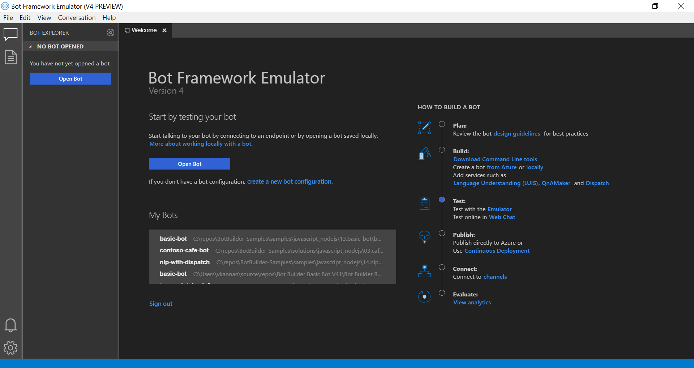
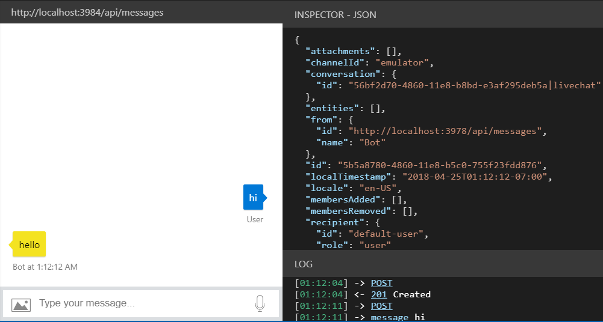
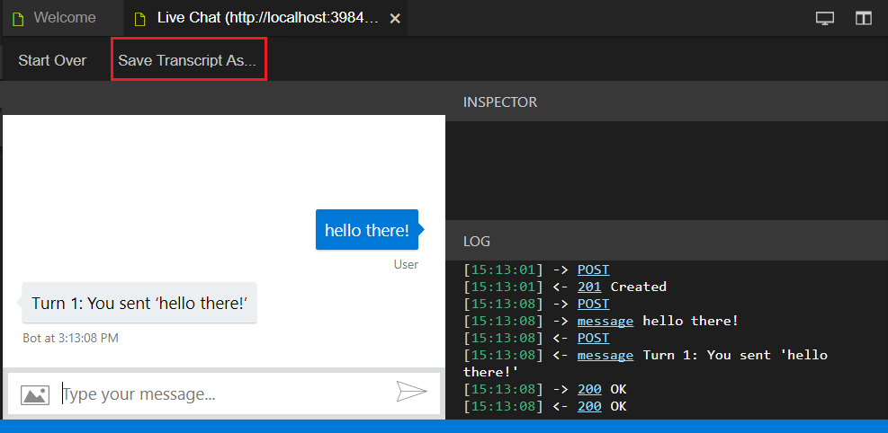
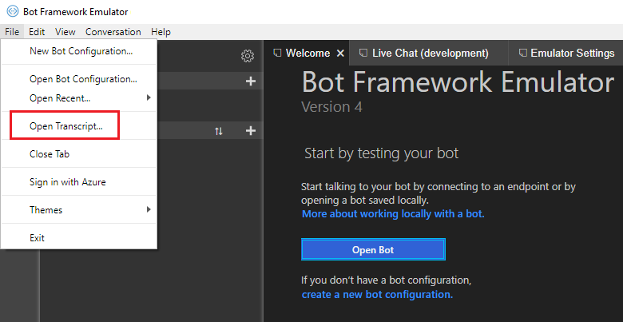
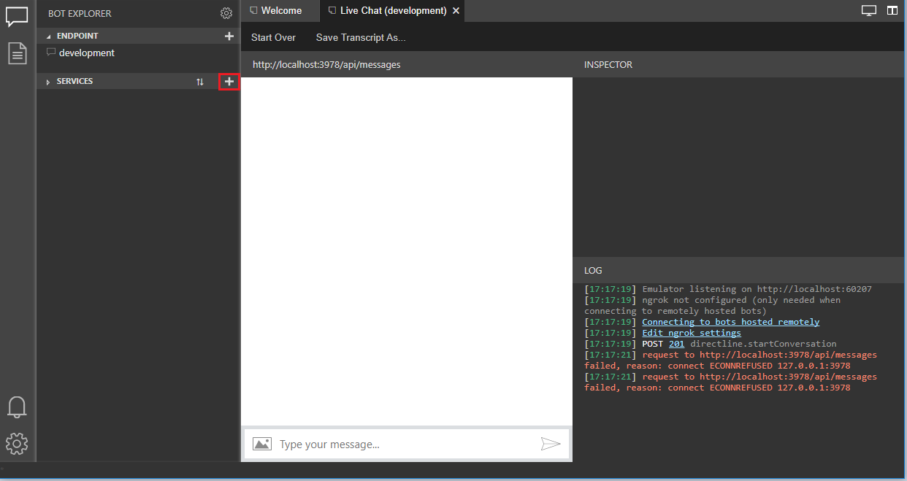
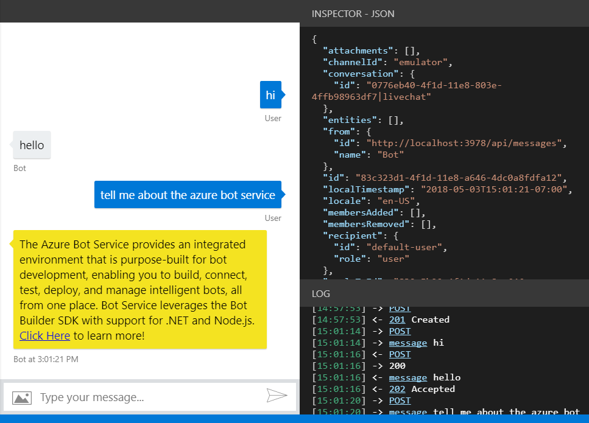
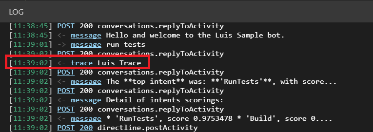
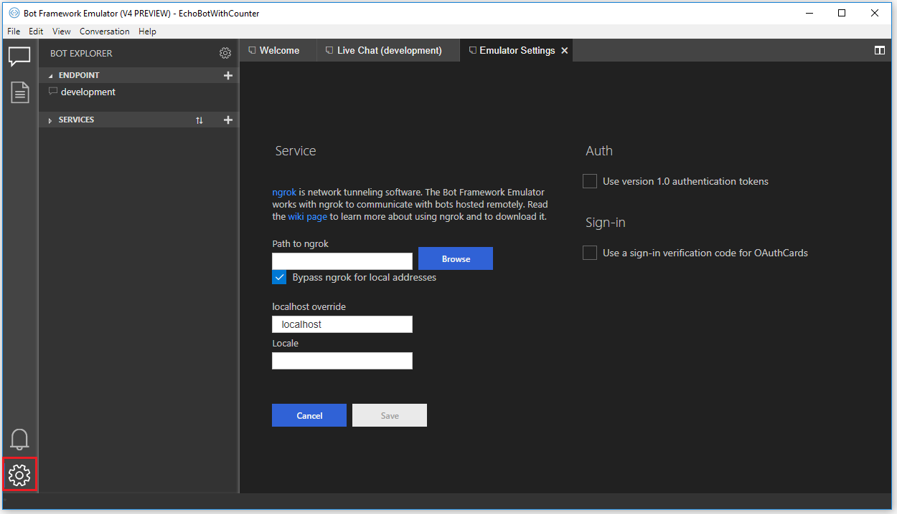

# Debug with the emulator

The Bot Framework Emulator is a desktop application that allows bot developers to test and debug their bots, either locally or remotely. Using the emulator, you can chat with your bot and inspect the messages that your bot sends and receives. The emulator displays messages as they would appear in a web chat UI and logs JSON requests and responses as you exchange messages with your bot. Before you deploy your bot to the cloud, run it locally and test it using the emulator. You can test your bot using the emulator even if you have not yet [created](./bot-service-quickstart.md) it with Azure Bot Service or configured it to run on any channels.

## Prerequisites
- Install [Emulator](https://github.com/Microsoft/BotFramework-Emulator/releases)
- Install [ngrok][ngrokDownload] tunnelling software

## Connect to a bot running on localhost

To connect to a bot running locally, click **Open bot** and select the .bot file. 

## View detailed Message Activity with the Inspector

Send message to your bot and the bot should respond back. You can click on message bubble within the conversation window and inspect the raw JSON activity using the **INSPECTOR** feature to the right of the window. When selected, the message bubble will turn yellow and the activity JSON object will be displayed to the left of the chat window. JSON information includes key metadata including channelID, activity type, conversation id, the text message, endpoint URL, etc. You can inspect activities sent from the user, as well as activities the bot responds with. 

## Save and load conversations with bot transcripts

Activities in the emulator can be saved as transcripts. From an open live chat window, select **Save Transcript As** to the transacript file. The **Start Over** button can be used any time to clear a conversation and restart a connection to the bot.  

To load transcripts, simply select **File > Open Tranascript File** and select the transcript. A new Transcript window will open and render the message activity to the output window. 

## Add services 

You can easily add a LUIS app, QnA knowledge base, or dispatch model to your .bot file directly from the emulator. When the .bot file is loaded, select the services button on the far left of the emulator window. You will see options under the **Services** menu to add LUIS, QnA Maker, and Dispatch. 

To add a service app, simply click on the **+** button and select the service you want to add. You will be prompted to sign in to the Azure portal to add the service to the bot file, and connect the service to your bot application. 

When either service is connected, you can go back to a live chat window and verify that your services are connected and working. 

## Inspect services

With the new v4 emulator you can also inspect the JSON responses from LUIS and QnA. Using a bot with a connected language service, you can select **trace** in the LOG window to the bottom right. This new tool also provides features to update your language services directly from the emulator. 

With a connected LUIS service, you'll notice that the trace link specifies **Luis Trace**. When selected, you'll see the raw response from your LUIS service, which includes intents, entities along with their specified scores. You also have the option to re-assign intents for your user utterances. 

With a connected QnA service, the log will display **QnA Trace**, and when selected you can preview the question and answer pair associated with that activity, along with a confidence score. From here, you can add alternative question phrasing for an answer.

## Configure ngrok

If you are using Windows and you are running the Bot Framework Emulator behind a firewall or other network boundary and want to connect to a bot that is hosted remotely, you must install and configure **ngrok** tunneling software. The Bot Framework Emulator integrates tightly with ngrok tunnelling software (developed by [inconshreveable][inconshreveable]), and can launch it automatically when it is needed.

Open the **Emulator Settings**, enter the path to ngrok, select whether or not to bypass ngrok for local addresses, and click **Save**.

## Additional resources

The Bot Framework Emulator is open source. You can [contribute][EmulatorGithubContribute] to the development and [submit bugs and suggestions][EmulatorGithubBugs].

[EmulatorGithubContribute]: https://github.com/Microsoft/BotFramework-Emulator/wiki/How-to-Contribute
[EmulatorGithubBugs]: https://github.com/Microsoft/BotFramework-Emulator/wiki/Submitting-Bugs-%26-Suggestions

[ngrokDownload]: https://ngrok.com/
[inconshreveable]: https://inconshreveable.com/
