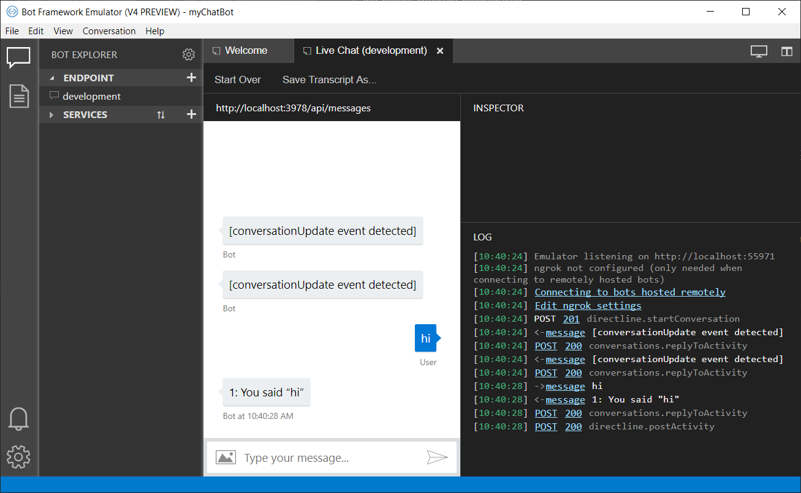

## Prerequisites

- [Visual Studio Code](https://www.visualstudio.com/downloads)
- [Node.js](https://nodejs.org/)
- [Yeoman](http://yeoman.io/), which uses a generator to create a bot for you
- [git](https://git-scm.com/)
- [Bot Framework Emulator](https://aka.ms/bot-framework-emulator-readme)
- Knowledge of [restify](http://restify.com/) and asynchronous programming in JavaScript

> [!NOTE]
> The install of Windows build tools listed below is only required if you use Windows as your development operating system. 
> For some installations the install step for restify is giving an error related to node-gyp.
> If this is the case you can try running this command with elevated permissions.
> This call may also hang without exiting if python is already installed on your system:

> ```bash
> npm install -g windows-build-tools
> ```

## Create a bot

To create your bot and initialize its packages

1. Open a terminal or elevated command prompt.
1. If you don't already have a directory for your JavaScript bots, create one and change directories to it. (We're creating a directory for your JavaScript bots in general, even though we're only creating one bot in this tutorial.)

   ```bash
   mkdir myJsBots
   cd myJsBots
   ```

1. Ensure your version of npm is up to date.

   ```bash
   npm install -g npm
   ```

1. Next, install Yeoman and the generator for JavaScript.

   ```bash
   npm install -g yo generator-botbuilder
   ```

1. Then, use the generator to create an echo bot.

   ```bash
   yo botbuilder
   ```

Yeoman prompts you for some information with which to create your bot. For this tutorial, use the default values.

- Enter a name for your bot. (myChatBot)
- Enter a description. (Demonstrate the core capabilities of the Microsoft Bot Framework)
- Choose the language for your bot. (JavaScript)
- Choose the template to use. (Echo)

Thanks to the template, your project contains all of the code that's necessary to create the bot in this quickstart. You won't actually need to write any additional code.

> [!NOTE]
> If you choose to create a `Basic` bot, you'll need a LUIS language model. You can create one on [luis.ai](https://www.luis.ai). After creating the model, update the configuration file.

## Start your bot

In a terminal or command prompt change directories to the one created for your bot, and start it with `npm start`. At this point, your bot is running locally.

## Start the Emulator and connect your bot

1. Start the Bot Framework Emulator.
2. Click the **Create a new bot configuration** link in the emulator "Welcome" tab. 
3. Fill out the fields for your bot, then click **Save and connect**.

Send a message to your bot, and the bot will respond back with a message.

