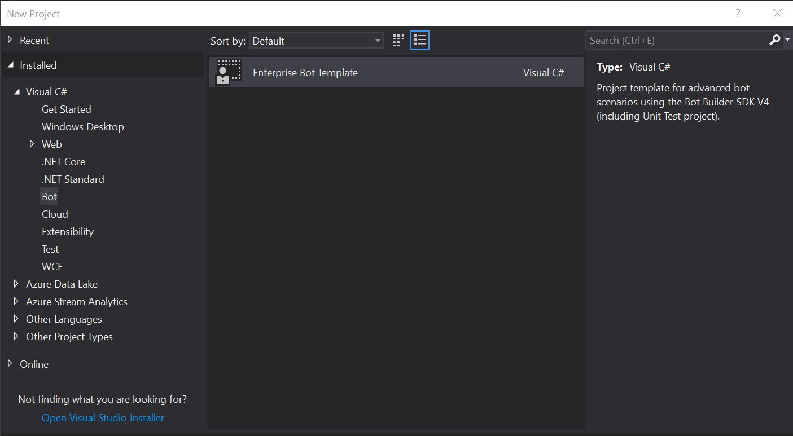
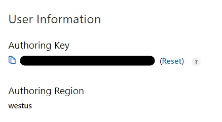
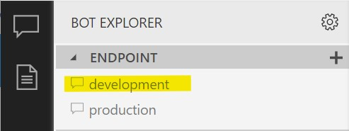
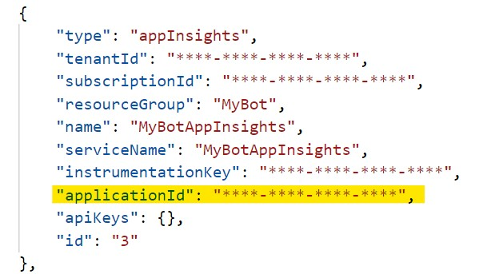

# Enterprise Bot Template - Getting Started

> [!NOTE]
> This topic applies to v4 version of the SDK. 

## Prerequisites

Install the following:
- [Enterprise Bot Template VSIX](https://marketplace.visualstudio.com/items?itemName=BotBuilder.botbuilderv4enterprise)
- [.NET Core SDK](https://www.microsoft.com/net/download) (latest version)
- [Node Package manager](https://nodejs.org/en/)
- [Bot Framework Emulator](https://docs.microsoft.com/en-us/azure/bot-service/bot-service-debug-emulator?view=azure-bot-service-4.0) (latest version)
- [Azure CLI](https://docs.microsoft.com/en-us/cli/azure/install-azure-cli?view=azure-cli-latest)
- [Azure Bot Service CLI tools](https://github.com/Microsoft/botbuilder-tools) (latest versions)
    ```shell
    npm install -g ludown luis-apis qnamaker botdispatch msbot chatdown
    ```
- [LuisGen](https://github.com/Microsoft/botbuilder-tools/blob/master/packages/LUISGen/src/npm/readme.md)
    ```shell
    dotnet tool install -g luisgen
    ```

## Create your bot project
1. In Visual Studio, click **File > New Project**.
1. Under **Bot**, select **Enterprise Bot Template**.



1. Name your project and click, **Create**.
1. Right click your project and click **Build** to restore your NuGet packages.

## Deploy your bot

Enterprise Template Bots require the following Azure services for end-to-end operation:
- Azure Web App
- Azure Storage Account (Transcripts)
- Azure Application Insights (Telemetry)
- Azure CosmosDb (Conversation State storage)
- Azure Cognitive Services - Language Understanding
- Azure Cognitive Services - QnA Maker (includes Azure Search, Azure Web App)

The following steps will help you to deploy these services using the provided deployment scripts:

1. Retrieve your LUIS Authoring Key.
   - Review [this](https://docs.microsoft.com/en-us/azure/cognitive-services/luis/luis-reference-regions) documentation page for the correct LUIS portal for your deployment region. Note that www.luis.ai refers to the US region and an authoring key retrieved from this portal will not work with a europe deployment.
   - Once signed in click on your name in the top right hand corner.
   - Choose **Settings** and make a note of the Authoring Key for later use.
    
    

1. Open up a Command Prompt.
1. Login into your Azure Account using the Azure CLI. You can find a list of subscriptions you have access to in the Azure Portal [Subscriptions](https://ms.portal.azure.com/#blade/Microsoft_Azure_Billing/SubscriptionsBlade) page.
    ```shell
    az login
    az account set --subscription "YOUR_SUBSCRIPTION_NAME"
    ```

1. Run the msbot clone services command to deploy your services and configure a .bot file in your project. **NOTE: After deployment is complete, you must make note of the bot file secret that is shown in the Command Prompt window for later use.**

    ```shell
    msbot clone services --name "YOUR-BOT-NAME" --luisAuthoringKey "YOUR_AUTHORING_KEY" --folder "DeploymentScripts\LOCALE_FOLDER" --location "REGION"
    ```

    > **Notes**:
    >- The **YOUR-BOT-NAME** parameter must be **globally unique**, and may only contain lowercase letters, numbers, and dashes ("-").
    >- Ensure the deployment region you provide in this step matches the region of your LUIS authoring key portal (e.g. westus for luis.ai or westeurope for eu.luis.ai).
    >- There is a known issue some users may experience with provisioning an MSA AppId and Password. If you recieve this error `ERROR: Unable to provision MSA id automatically. Please pass them in as parameters and try again`, please go to [Application Portal](https://portal.azure.com/#blade/Microsoft_AAD_RegisteredApps/ApplicationsListBlade) and manually create a new application, making note of the AppId and Password/Secret. Run the above msbot clone services command again, providing two new arguments `--appId` and `--appSecret` with the values you've just retrieved. You may need to escape any special characters in the password that might be interpreted by the shell to be a command:
    >   - For *Windows command prompt*, enclose the appSecret in double quotes. e.g. 
    `msbot clone services --name xxxx --luisAuthoringKey xxxx --location xxxx --folder bot.recipe --appSecret "YOUR_APP_SECRET"`
    >   - For *Windows PowerShell, try passing in appSecret after the --% argument. e.g. 
    `msbot clone services --name xxxx --luisAuthoringKey xxxx --location xxxx --folder bot.recipe --% --appSecret "YOUR_APP_SECRET"`
    >   - For *MacOS or Linux*, enclose the appSecret in single quotes. e.g. 
    `msbot clone services --name xxxx --luisAuthoringKey xxxx --location xxxx --folder bot.recipe --appSecret 'YOUR_APP_SECRET'`

1. After deployment is complete, update **appsettings.json** with your bot file secret. 
    
    ```
    "botFilePath": "./YOUR_BOT_FILE.bot",
    "botFileSecret": "YOUR_BOT_SECRET",
    ```
1. Run the following command and retrieve the InstrumentationKey for your Application Insights instance.
    ```
    msbot list --bot YOUR_BOT_FILE.bot --secret "YOUR_BOT_SECRET"
    ```

1. Update **appsettings.json** with your instrumentation key:

    ```
    "ApplicationInsights": {
        "InstrumentationKey": "YOUR_INSTRUMENTATION_KEY"
    }
    ```

## Test your bot

Once complete, run your bot project within your development environment and open the **Bot Framework Emulator**. Within the Emulator, click **File > Open Bot** and navigate to the .bot file in your directory.



You should receive an introduction message when the conversation begins.

Type ```hi``` to verify everything is working.

## Publish your bot

Testing can be performed end-to-end locally. When you're ready to deploy your Bot to Azure for additional testing you can use the following command to publish the source code:

```shell
az bot publish -g YOUR-BOT-NAME -n YOUR-BOT-NAME --proj-name YOUR-BOT-NAME.csproj --version v4
```

## View your bot analytics
The Enterprise Bot Template comes with a preconfigured Power BI dashboard that connects to your Application Insights service to provide conversation analytics. Once you have tested your bot locally, you can open this dashboard to view the data. 

1. Download the Power BI dashboard (.pbit file) [here](https://github.com/Microsoft/AI/blob/master/solutions/analytics/ConversationalAnalyticsSample_02132019.pbit).
1. Open the dashboard in [Power BI Desktop](https://powerbi.microsoft.com/en-us/desktop/).
1. Enter your Application Insights Application Id (found in your .bot file).

    

1. Learn more about the Power BI dashboard features [here](https://github.com/Microsoft/AI/tree/master/solutions/analytics).

# Next Steps

After you have successfully deployed your bot out of the box, you can customize the bot for your scenario and needs. Continue with [Customize the Bot](bot-builder-enterprise-template-customize.md).
