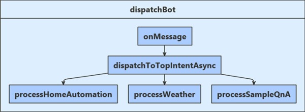
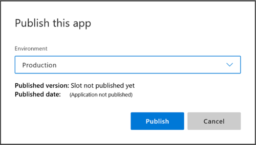
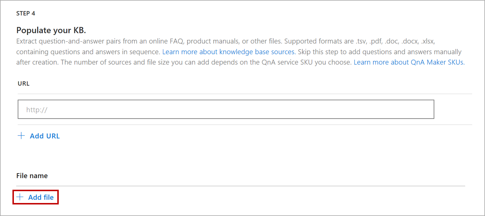

--- 
title: Use multiple LUIS and QnA models | Microsoft Docs
description: Learn how to use LUIS and QnA maker in your bot.
keywords: Luis, QnA, Dispatch tool, multiple services, route intents
author: DeniseMak
ms.author: v-demak
manager: kamrani
ms.topic: article
ms.service: bot-service
ms.subservice: sdk
ms.date: 04/15/2019
monikerRange: 'azure-bot-service-4.0'
---

# Use multiple LUIS and QnA models

[!INCLUDE[applies-to](../includes/applies-to.md)]

If a bot uses multiple LUIS models and QnA Maker knowledge bases (KBs), you can use Disptach tool to determince which LUIS model or QnA Maker KB best maches the user input. The dispatch tool does this by creating a single LUIS app to route user input to the corrrect model. For more information about the Disptach, including the CLI commands, refer to the [README][dispatch-readme].

## Prerequisites
- Knowledge of [bot basics](bot-builder-basics.md), [LUIS][howto-luis], and [QnA Maker][howto-qna]. 
- [Dispatch tool](https://github.com/Microsoft/botbuilder-tools/tree/master/packages/Dispatch)
- A copy of the **NLP with Dispatch** from either the [C# Sample][cs-sample] or [JS Sample][js-sample] code repository.
- A [luis.ai](https://www.luis.ai/) account to publish LUIS apps.
- A [QnA Maker](https://www.qnamaker.ai/) account to publish the QnA knowledge base.

## About this sample

This sample is based on a predefined set of LUIS and QnA Maker Apps.

## [C#](#tab/cs)


`OnMessageActivityAsync` is called for each user input received. This module finds the the top scoring user intent and passes that result on to `DispatchToTopIntentAsync`. DispatchToTopIntentAsync, in turn, calls the appropriate app handler

- `ProcessSampleQnAAsync` - for bot faq questions.
- `ProcessWeatherAsync` - for weather queries.
- `ProcessHomeAutomationAsync` - for home lighting commands.

## [JavaScript](#tab/js)



`onMessage` is called for each user input received. This module finds the the top scoring user intent and passes that result on to `dispatchToTopIntentAsync`. dispatchToTopIntentAsync, in turn, calls the appropriate app handler

- `processSampleQnA` - for bot faq questions.
- `processWeather` - for weather queries.
- `processHomeAutomation` - for home lighting commands.

---

The handler calls the LUIS or QnA Maker service and returns the generated result back to the user.

## Create LUIS apps and QnA KB
Before you can create the dispatch model, you'll need to have your LUIS apps and QnA KBs created and published. In this article, we'll publish the following models that are inculded with the _NLP With Dispatch_ sample in the `\CognitiveModels` folder: 

| Name | Description |
|------|------|
| HomeAutomation | A LUIS app that recognizes a home automation intent with associated entity data.|
| Weather | A LUIS app that recognizes weather related intents with location data.|
| QnAMaker  | A QnA Maker KB that provides answers to simple questions about the bot. |

### Create LUIS apps
1. Log into the [LUIS web portal](https://www.luis.ai/). Under section _My apps_ select the Tab _Import new app_. The following Dialog Box will appear:


2. Select the button _Choose app file_, navigate to the CognitiveModel folder of your sample code and select the file 'HomeAutomation.json'. Leave the optional name field blank. 

3. Select _Done_.

4. Once LUIS opens up your Home Automation app, select the _Train_ button. This will train your app using the set of utterances you just imported using the 'home-automation.json' file.

5. When training is complete, select the _Publish_ button. The following Dialog Box will appear:



6. Choose the 'production' environment and then select the _Publish_ button.

7. Once your new LUIS app has been published, select the _MANAGE_ Tab. From the 'Application Information' page, record the values `Application ID` as "_app-id-for-app_" and `Display name` as "_name-of-app_". From the 'Key and Endpoints' page, record the values `Authoring Key` as "_your-luis-authoring-key_" and `Region` as "_your-region_". These values will later be used within your 'appsetting.json' file.

8. Once completed, _Train_ and _Publish_ both your LUIS weather app and your LUIS dispatch app by repeating the above steps for 'Weather.json' file.

### Create QnA Maker KB

The first step to setting up a QnA Maker KB is to set up a QnA Maker service in Azure. To do that, follow the step-bystep instructions found [here](https://aka.ms/create-qna-maker). Now log into the [QnAMaker web portal](https://qnamaker.ai). Move down to Step 2


and select
1. Your Azure AD account.
1. Your Azure subscription name.
1. The name you created for your QnA Maker service. (If your Azure QnA service does not initially appear in this pull down list, try refreshing the page.) 

Move to Step 3


Provide a name for your QnA Maker knowledgebase. For this example we will be using the name 'sample-qna'.

Move to Step 4



select the option _+ Add File_, navigate to the CognitiveModel folder of your sample code, and select the file 'QnAMaker.tsv'

There is an additional selection to add a _Chit-chat_ personality to your knowledgebase but our example does not include this option.

Move to Step 5

select _Create your KB_.

Once a knowledgebase has been created from your uploaded file, select _Save and train_ and when finished select the _PUBLISH_ Tab and publish your app.

Once your QnA Maker app is published, select the _SETTINGS_ Tab, and scroll down to 'Deployment details'. Record the following values from the _Postman_ Sample HTTP request.

```text
POST /knowledgebases/<knowledge-base-id>/generateAnswer
Host: <your-hostname>  // NOTE - this is a URL.
Authorization: EndpointKey <your-endpoint-key>
```

The full URL string for your hostname will look like "https://< >.azure.net/qnamaker".

These values will later be used within your `appsettings.json` or `.env` file.

Note the LUIS app and QnA Maker knowledge base names and IDs. Also note your LUIS authoring key and your Cognitive Services subscription key. You will need all this information to complete this process.

## Create the dispatch model

The CLI interface for the dispatch tool creates the model for dispatching to the correct service.

1. Open a command prompt or terminal window, and change directories to the **CognitiveModels** directory
1. Make sure you have the current version of npm and the Dispatch tool.

    ```cmd
    npm i -g npm
    npm i -g botdispatch
    ```

1. Use `dispatch init` to initialize create a .dispatch file for your dispatch model. Create this usinga filename you will recognize.

    ```cmd
    dispatch init -n <filename-to-create> --luisAuthoringKey "<your-luis-authoring-key>" --luisAuthoringRegion <your-region>
    ```

1. Use `dispatch add` to add your LUIS apps and QnA Maker knowledge bases to the .dispatch file.

    ```cmd
    dispatch add -t luis -i "<app-id-for-weather-app>" -n "<name-of-weather-app>" -v <app-version-number> -k "<your-luis-authoring-key>" --intentName l_Weather
    dispatch add -t luis -i "<app-id-for-home-automation-app>" -n "<name-of-home-automation-app>" -v <app-version-number> -k "<your-luis-authoring-key>" --intentName l_HomeAutomation
    dispatch add -t qna -i "<knowledge-base-id>" -n "<knowledge-base-name>" -k "<your-cognitive-services-subscription-id>" --intentName q_sample-qna
    ```

1. Use `dispatch create` to generate a dispatch model from the .dispatch file.

    ```cmd
    dispatch create
    ```

1. Publish the dispatch LUIS app using the generated dispatch model JSON file.

## Use the dispatch model

The generated model defines intents for each of the apps and knowledge bases, as well as a _none_ intent for when the utterance doesn't have a good fit.

- `l_HomeAutomation`
- `l_Weather`
- `None`
- `q_sample-qna`

Note that these services need to be published under the correct names for the bot to run properly.

The bot needs information about the published services, so that it can access those services.

## [C#](#tab/cs)

### Installing packages

Prior to running this app for the first time ensure that several nuget packages are installed:

**Microsoft.Bot.Builder**

**Microsoft.Bot.Builder.AI.Luis**

**Microsoft.Bot.Builder.AI.QnA**

### Manually update your appsettings.json file

Once all of your service apps are created, the information for each needs to be added into your 'appsettings.json' file. The initial [C# Sample][cs-sample] code contains an empty appsettings.json file:

**appsettings.json**
[!code-json[AppSettings](~/../botbuilder-samples/samples/csharp_dotnetcore/14.nlp-with-dispatch/AppSettings.json?range=8-17)]

For each of the entities shown below, add the values you recorded earlier in these instructions:

**appsettings.json**
```json
"MicrosoftAppId": "",
"MicrosoftAppPassword": "",
  
"QnAKnowledgebaseId": "<knowledge-base-id>",
"QnAAuthKey": "<your-endpoint-key>",
"QnAEndpointHostName": "<your-hostname>",

"LuisAppId": "<app-id-for-dispatch-app>",
"LuisAPIKey": "<your-luis-authoring-key>",
"LuisAPIHostName": "<your-dispatch-app-region>",
```
When all changes are inplace, save this file.

## [JavaScript](#tab/js)

### Installing packages

Prior to running this app for the first time you will need to install several npm packages.

```powershell
npm install --save botbuilder
npm install --save botbuilder-ai
```
To use the .env configuration file, your bot needs an extra package included:

```powershell
npm install --save dotenv
```

### Manually update your .env file

Once all of your service apps are created, the information for each needs to be added into your '.env' file. The initial [JavaScript Sample][js-sample] code contains an empty .env file. 

**.env**
[!code-file[EmptyEnv](~/../botbuilder-samples/samples/javascript_nodejs/14.nlp-with-dispatch/.env?range=1-10)]

Add your service connection values as shown below:

**.env**
```file
MicrosoftAppId=""
MicrosoftAppPassword=""

QnAKnowledgebaseId="<knowledge-base-id>"
QnAAuthKey="<your-endpoint-key>"
QnAEndpointHostName="<your-hostname>"

LuisAppId=<app-id-for-dispatch-app>
LuisAPIKey=<your-luis-authoring-key>
LuisAPIHostName=<your-dispatch-app-region>

```
When all changes are inplace, save this file.

---

### Connect to the services from your bot

To connect to the Dispatch, LUIS, and QnA Maker services, your bot pulls information from the settings you have previously provided.

## [C#](#tab/cs)

In **BotServices.cs**, the information contained within configuration file _appsettings.json_ is used to connect your dispatch bot to the `Dispatch` and `SampleQnA` services. The constructors use the values you provided to connect to these services.

**BotServices.cs**
[!code-csharp[ReadConfigurationInfo](~/../botbuilder-samples/samples/csharp_dotnetcore/14.nlp-with-dispatch/BotServices.cs?range=14-30)]

## [JavaScript](#tab/js)

In **dispatchBot.js** the information contained within configuration file _.env_ is used to connect your dispatch bot to the _LuisRecognizer(dispatch)_ and _QnAMaker_ services. The constructors use the values you provided to connect to these services.

**dispatchBot.js**
[!code-javascript[ReadConfigurationInfo](~/../botbuilder-samples/samples/javascript_nodejs/14.nlp-with-dispatch/bots/dispatchBot.js?range=18-31)]

---

### Call the services from your bot

For each input  from your user, the bot logic checks user input against the combined Dispatch model, finds the top returned intent, and uses that information to call the appropriate service for the input.

## [C#](#tab/cs)

In the **DispatchBot.cs** file whenever the `OnMessageActivityAsync` method is called, we check the incoming user message against the Dispatch model. We then pass the Dispatch Model's `topIntent` and  `recognizerResult` on to the correct method to call the service and return the result.

**DispatchBot.cs**
[!code-csharp[OnMessageActivity](~/../botbuilder-samples/samples/csharp_dotnetcore/14.nlp-with-dispatch/bots/DispatchBot.cs?range=26-36)]

## [JavaScript](#tab/js)

In the **dispatchBot.js** `onMessage` method, we check the user input message against the Dispatch model, find the _topIntent_, then pass this on by calling _dispatchToTopIntentAsync_.

**dispatchBot.js**

[!code-javascript[OnMessageActivity](~/../botbuilder-samples/samples/javascript_nodejs/14.nlp-with-dispatch/bots/dispatchBot.js?range=37-50)]

---

### Work with the recognition results

## [C#](#tab/cs)

When the model produces a result, it indicates which service can most appropriately process the utterance. The code in this bot routes the request to the corresponding service, and then summarizes the response from the called service. Depending on the _intent_ returned from Dispatch, this code uses the returned intent to route to the correct LUIS model or QnA service.

**DispatchBot.cs**
[!code-csharp[DispatchToTop](~/../botbuilder-samples/samples/csharp_dotnetcore/14.nlp-with-dispatch/bots/DispatchBot.cs?range=51-69)]

If method `ProcessHomeAutomationAsync` or `ProcessWeatherAsync` are invoked, they are passed the results from the dispatch model within _luisResult.ConnectedServiceResult_. The specified method then provides user feedback showing the dispatch model top intent, plus a ranked listing of all intents and entities that were detected.

If method `q_sample-qna` is invoked, it uses the user input contained within the turnContext to generate an answer from the knowledgebase and display that result to the user.

## [JavaScript](#tab/js)

When the model produces a result, it indicates which service can most appropriately process the utterance. The code in this sample uses the recognized _topIntent_ to show how to route the request on to the corresponding service.

**DispatchBot.cs**
[!code-javascript[DispatchToTop](~/../botbuilder-samples/samples/javascript_nodejs/14.nlp-with-dispatch/bots/dispatchBot.js?range=67-83)]

If method `processHomeAutomation` or `processWeather` are invoked, they are passed the results from the dispatch model within _recognizerResult.luisResult_. The specified method then provides user feedback showing the dispatch model's top intent, plus a ranked listing of all intents and entities that were detected.

If method `q_sample-qna` is invoked, it uses the user input contained within the turnContext to generate an answer from the knowledgebase and display that result to the user.

---

> [!NOTE]
> If this were a production application, this is where the selected LUIS methods would connect to their specified service, pass in the user input, and process the returned LUIS intent and entity data.

## Test your bot

Using your development environment, start the sample code. Note the localhost address shown in the address bar of the browser window opened by your App: "https://localhost:<Port_Number>" After opening your Bot Framework Emulator, select the blue test outlined below `create new bot configuration`.


Enter the localhost address you recorded, adding '/api/messages' to the end: "https://localhost:<Port_Number>/api/messages"


Now click the `Save and connect` button to access your running bot. For your reference, here are some of the questions and commands that are covered by the services built for your bot:

- QnA Maker
  - `hi`, `good morning`
  - `what are you`, `what do you do`
- LUIS (home automation)
  - `turn on bedroom light`
  - `turn off bedroom light`
  - `make some coffee`
- LUIS (weather)
  - `whats the weather in redmond washington`
  - `what's the forecast for london`
  - `show me the forecast for nebraska`

## Additional information

Once your bot is running, it is possible to improve the bot's performance by removing similar or overlapping utterances. For example, let's say that in the `Home Automation` LUIS app  requests like "turn my lights on" map to a "TurnOnLights" intent, but requests like "Why won't my lights turn on?" map to a "None" intent so that they can be passed on to QnA Maker. When you combine the LUIS app and the QnA Maker service using dispatch, you need to do one of the following:

- Remove the "None" intent from the original `Home Automation` LUIS app, and instead add the utterances from that intent to the "None" intent in the dispatcher app.
- If you don't remove the "None" intent from the original LUIS app, you will instead need to add logic into your bot to pass the messages that match your "None" intent on to the QnA maker service.

Either of the above two actions will reduce the number of times that your bot responds back to your users with the message, 'Couldn't find an answer.'

### To update or create a new LUIS model

This sample is based on a preconfigured LUIS model. Additional information to help you update this model, or create a new LUIS model, can be found [here](https://aka.ms/create-luis-model#updating-your-cognitive-models).

### To delete resources

This sample creates a number of applications and resources that you can delete using the steps listed below, but you should not delete resources that *any other apps or services* rely on.

To delete LUIS resources:

1. Sign in to the [luis.ai](https://www.luis.ai) portal.
1. Go to the _My Apps_ page.
1. Select the apps created by this sample.
   - `Home Automation`
   - `Weather`
   - `NLP-With-Dispatch-BotDispatch`
1. Click _Delete_, and click _Ok_ to confirm.

To delete QnA Maker resources:

1. Sign in to the [qnamaker.ai](https://www.qnamaker.ai/) portal.
1. Go to the _My knowledge bases_ page.
1. Click the delete button for the `Sample QnA` knowledge base, and click _Delete_ to confirm.

### Best practice

To improve services used in this sample, refer to best practice for [LUIS](https://docs.microsoft.com/en-us/azure/cognitive-services/luis/luis-concept-best-practices), and [QnA Maker](https://docs.microsoft.com/en-us/azure/cognitive-services/qnamaker/concepts/best-practices).


[howto-luis]: bot-builder-howto-v4-luis.md
[howto-qna]: bot-builder-howto-qna.md

[cs-sample]: https://aka.ms/dispatch-sample-cs
[js-sample]: https://aka.ms/dispatch-sample-js

[dispatch-readme]: https://aka.ms/botbuilder-tools-dispatch
